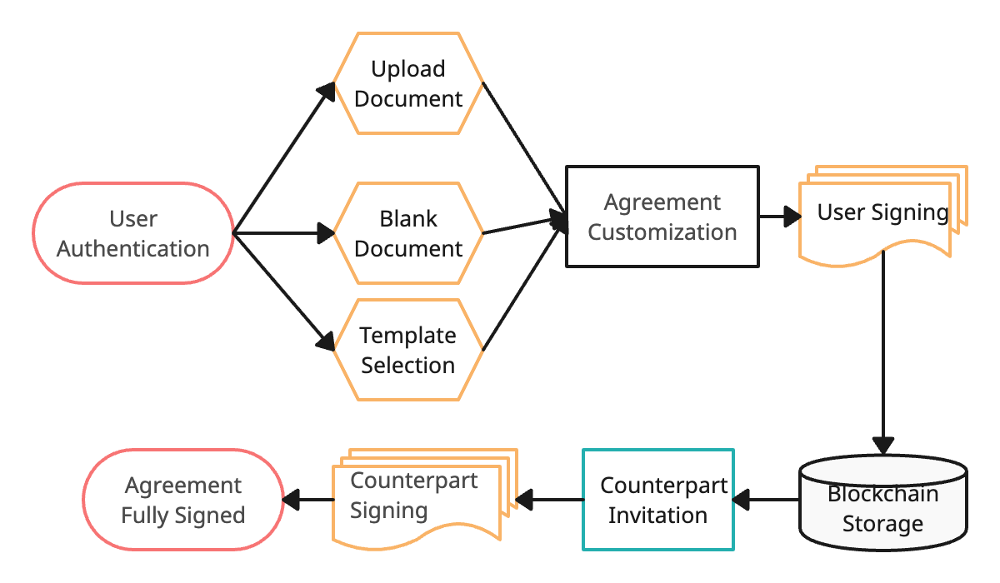

# Docsig 
A Dapp to sign and exchange documents notarized on the blockchain.
It's based on [Substrate framework](https:/substrate.dev) for the blockchain and
[Polkadot.js](https://polkadot.js.org/extension/) or [Subwallet](https://www.subwallet.app/) for the wallets supported.  

  
A live demo is available at:  
[https://docsig.aisland.io](https://docsig.aisland.io)  
The demo works on the testnet of [Aisland blockchain](https://aisland.io).  
  
You can use the faucet available at:  
[https://testnet.aisland.io:8443](https://testnet.aisland.io:8443) to get some AISC tokens for free.  
## Architecture Workflow


## Requirements:
- [Nodejs >20.x](https://nodejs.org)  
- [Mariadb Server](https://mariadb.org)

## Installation

- install [Nodejs](https://nodejs.org) following the instructions on the official website  
- install [Mariadb](https://mariadb.com)
- on Linux Ubuntu/Debian you will need a bunch of dependencies that you can install with:  
```
apt-get install build-essential git libnss3-dev libatk1.0-dev libatk-bridge2.0-dev libcups2-dev libdrm-dev libxkbcommon-dev libxcomposite-dev libxrandr-dev libgbm-dev libpango1.0-dev libasound2-dev
```
ATTENTION: please use a regular user for the installation and launch, since some dependencies does not run as "root" user for security.  

clone the repo with:  
```
git clone https://github.com/aisland-dao/docsig
```
- create a database named: docsig with:  
```bash
mysql
create database docsig;
exit;
```
import the database schema with:  
```bash
mysql docsig < create_database_tables.sql
```
create a a database user changing the password 'your_password' in something different:  
```
mysql
CREATE USER 'docsig'@'localhost' IDENTIFIED BY 'your_password';
GRANT ALL PRIVILEGES ON docsig.* TO 'docsig'@'localhost';
FLUSH PRIVILEGES;
```
edit the file docsig-server.sh and customize with your new password.  

```bash
install the dependencies for nodejs:  
```bash
npm install
```

## Run
```bash
./docsig-server.sh
```
you will be able to reach the user interface browsing:  
http://localhost:3000  

You may install a reverse proxy like Nginx to manage the https connections.  


## Unit Tests
A set of of unit tests on main core functions and API is avaible and requires to run the API server with some dummy data:
- in one session run the testing environment executing:  
```
./test.sh
```
if everything works, you should see the node server running:  
```
DocSig Server - v.x.xx
Listening on port tcp/3000 ....
```
open a new session and execute:  
```
npm test
```
you should see:  
```
Test Suites: 1 passed, 1 total
Tests:       30 passed, 30 total
Snapshots:   0 total
Time:        1.704 s, estimated 2 s
```
After the test, close the first session, stopping the API server and  cleanup the dummy database and data,executing:  
```
./test_clean.sh
```

## Docker

**Requirements**
-  [docker composer](https://www.docker.com)  
- [Nodejs >20.x](https://nodejs.org)

**Installation**  
- Install docker engine include docker compose for example for [Debian](https://docs.docker.com/engine/install/debian/)
- Install Nodejs
and install the dependencies with:  
```
npm install
```
**Running**  
You can run the docker containers with the following commands:
```
docker compose up -d
```
** Browsing **  
The dapp will be accessible browsing:  
```
http://localhost:3000
```

## Substrate Pallet
The Dapp uses a dedicated pallet named "docsig". The source code and an example of implementation in the runtime can be found on Aisland-node:  
- [Pallet docsig](https://github.com/aisland-dao/aisland-node/tree/main/pallets/docsig)  
- [Runtime Implementation](https://github.com/aisland-dao/aisland-node/blob/66433f01b1ec232ca013a7d2cb8d8ca1eaebe007/runtime/src/lib.rs#L283)  

## Build Code:
If you wish to change the client code, you should edit the files in client-src and launch ./build.sh to rebuild the bundle.js wich is the one pulled from the html files.


## Encryption Protocol:

At the core of the project there is a multi-layer encryption protocol used to exchange privately the documents stored on blockchain:

[CryptoStream](https://github.com/aisland-dao/docsig/blob/main/modules/cryptostream.js)  

The user is invited to generate a keys pair for encryption purpose only, from a random seed.
Such keys pair is encrypted by a password calling the following function:  
```
function encrypt_symmetric_stream(msg,password)
```
The password is used to derive a 512 bit private key.  
The key is divided in 2 parts of 256 bit each.  
The "msg" is encrypted usign AES-256 bit GCM using the first 256 bit key and the result is encrypted again by chacha20-poly1305 using the second 256 bit key.
The final result is an encrypted mgs theorically resistant to the future quantum computer.  

the opposite function to decrypt is:  
```
function decrypt_symmetric_stream(msg,password)
```

The documents stored on blockchain are encrypted calling the function:  
```
function encrypt_asymmetric_stream(msg,senderprivatekey,senderpublickey,recipientpublickeys){
```
Where "recipientpublickeys" is an array of possible recipients of the document.  
A random password of 512 bit is generated for each document.  
The password is divided in 3 chunks of 256 bit each one.  
The "msg" is encrypted a first time, using AES algorithm and first chunk of 256bit.  
The result is encrypted again using Chacha 20 algorith and the second chunk of 256 bit.  
The private key is encrypte for each recipient using "x25519" algorithm, obtain the result that the  document encrypted is readable only from those authorised.

The opposite function to decrypt is:  
``````
async function decrypt_asymmetric_stream(encmsgb,privatekey,publickey){
```
